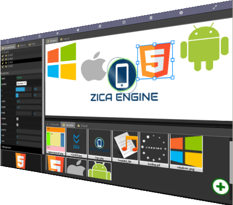
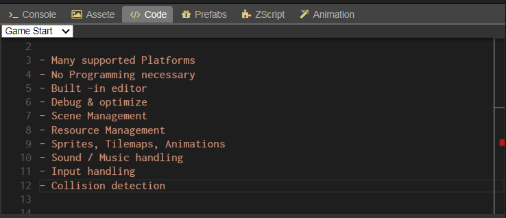
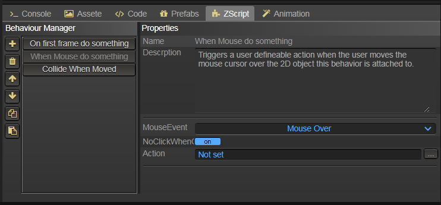
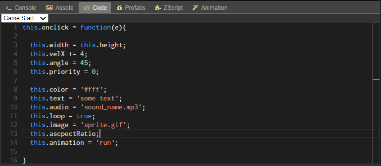

## ZICA Engine

Homepage: https://zica39.github.io/zicaengine/

#### 2D cross-platform game engine

ZICA Engine is a simple cross-platform game engine to create 2D games & apps without programming. It provides a comprehensive set of common
tools, so that users can focus on making games without programming( with just a few clicks ).
But also supports scripting for advanced users. Games can be exported in one click to a number of platforms, including
desktop platforms (Linux, Mac OSX, Windows), mobile
(Android) and web-based (HTML5) platforms.

#### Features

#### Rapidly develop your ideas whit ZScript event system

## To do...
- [ ] Windows Mac Linux 32&64 build
- [ ] Image & audio editor
- [ ] RPG map editor
- [ ] iOS buid
- [ ] Physic engine
- [ ] Demos
- [ ] Docs & tutorials
- [ ] Undo/Redo
- [ ] Serialization
- [ ] GUI components
- [ ] Timeline editor
- [ ] More actions and behaviors

#### Code example

### License

- ZICA Enigne uses a MIT license that allow for commercial usage of the platform without any cost.
- The license is available on the project GitHub page

- The project  build on top of open source libraries [nwjs.io](https://nwjs.io), [monaco-editor](https://microsoft.github.io/monaco-editor/), [dat.gui](https://github.com/dataarts/dat.gui), [litegui.js](https://github.com/jagenjo/litegui.js), [javascript-sandbox-console](http://openexchangerates.github.io/javascript-sandbox-console/)
